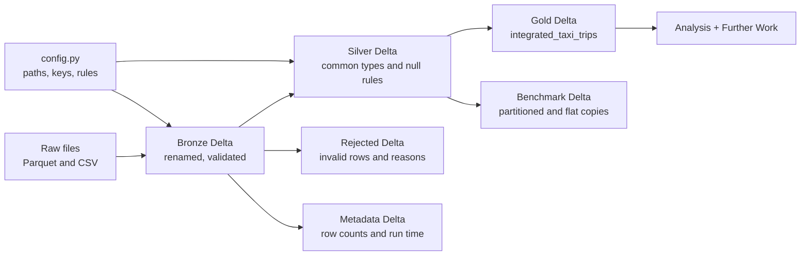

# Architecture Diagram

```mermaid
flowchart LR
    A[Raw files
Parquet and CSV] --> B[Bronze Delta
renamed, validated]
    B --> C[Silver Delta
common types and null rules]
    C --> D[Gold Delta
integrated_taxi_trips]
    C --> E[Benchmark Delta
partitioned and flat copies]
    B --> F[Rejected Delta
invalid rows and reasons]
    B --> G[Metadata Delta
row counts and run time]
    D --> H[Analysis + Further Work]

    I[config.py
paths, keys, rules] --> B
    I --> C
```

