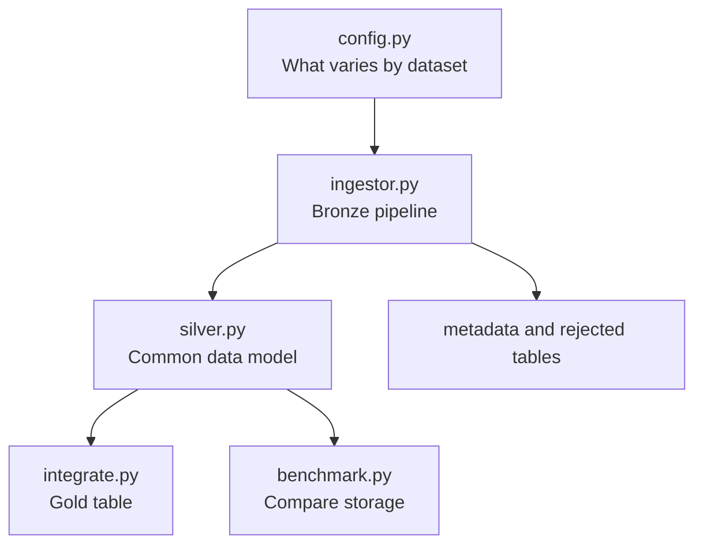

# Read the Codebase in This Order

## 1. Start with the picture

Read [architecture_diagram.md](architecture_diagram.md), then [README.md](../README.md). The project takes four source datasets and produces one enriched taxi-trip table.

## 2. Read `src/ingestion/config.py`

This is the control panel. Each dataset says where its file is, its format, key columns, required columns, partitions, and simple validity rule. This avoids four almost-identical ingestion scripts.

Ask: “What is different about taxi trips, weather, air quality, and zones?” The answer is here.

## 3. Read `src/ingestion/ingestor.py`

This is the generic bronze pipeline:

1. Load CSV or Parquet.
2. Rename columns to snake_case.
3. Check required columns.
4. Parse timestamps and create `year` and `month` where needed.
5. Reject bad keys, duplicate keys, and invalid timestamps.
6. Apply each dataset's simple rule.
7. Write Delta and append run metadata.

Why: raw datasets arrive in different shapes, but the repeated work is the same.

## 4. Read `src/ingestion/silver.py`

Silver makes the bronze tables safe to join. It removes empty columns, uses sensible types, fills specific missing weather values, and creates `aq_timestamp` by joining the air-quality date and time. This last step matters because a time such as `14:00` needs a date before it can match a taxi pickup hour.

## 5. Read `src/integration/integrate.py`

Gold starts with cleaned taxi trips. It adds:

- weather by pickup hour;
- PM2.5 by pickup hour from one fixed NYC monitoring site;
- pickup and dropoff zone labels.

All joins are left joins, so a missing context record does not remove a valid trip. The small tables are broadcast because sending a tiny lookup to each worker is cheaper than shuffling millions of trips.

## 6. Read the three entry points

| File | Run it when | Result |
|---|---|---|
| `run_ingestion.py` | raw files are ready | bronze and silver tables |
| `run_integration.py` | silver exists | gold table |
| `run_benchmark.py` | silver exists | partitioned-vs-flat measurements |

Use `inspect_bronze.py` after ingestion to see schemas, null counts, and the metadata log.

## 7. Read `src/benchmark/benchmark.py` last

It writes the same taxi data twice: once partitioned by month and once flat. It then measures write time, file count, size, and three queries. The lesson is simple: partitioning helps only when a query filters on the partition columns.

## What not to overthink yet

You do not need to understand every Spark configuration or every function call. First understand the data path:

`raw -> bronze -> silver -> gold -> analysis`

Then understand why each layer exists: recoverability, clean joins, and a single dataset for analysis.
