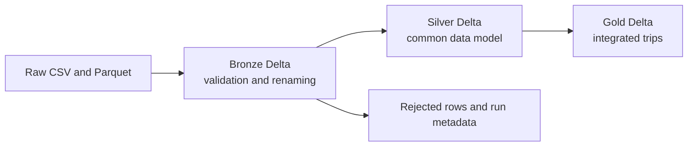

# Week 1 Design Report: Urban Data Integration Platform

## Purpose

This project builds a reusable Spark and Delta Lake platform for four urban datasets: taxi trips, weather, air quality, and taxi zones. It preserves source data, validates and standardises it, and creates one analytical table in which each taxi trip has weather, air-quality, and zone context. The design follows a raw, bronze, silver, and gold structure so that later errors can be corrected without changing the source files.

## Data Catalog

| Dataset | Entity and key | Main join fields | Growth and notes |
|---|---|---|---|
| Taxi trips | One trip; no reliable natural key | Pickup/dropoff location; pickup hour | Large fact table; grows continuously. A tested composite key was not unique, so no artificial key is used. |
| Weather | One hourly observation; year, month, day, hour | Constructed hourly timestamp | Small reference dataset. |
| Air quality | One site/parameter observation; site, parameter, POC, local date/time | Selected site and hourly timestamp | Large sensor dataset with many sites. |
| Taxi zones | One zone; location ID | Pickup and dropoff location ID | Small lookup table. |

The main integration risk is air quality. A time-only join would match a trip to many monitoring sites and multiply trip rows. The platform selects one documented NYC site and aggregates duplicate records from that site within the same hour.

## Storage Architecture

Raw files remain unchanged in `data/raw`. Bronze Delta tables apply only column renaming, timestamp parsing, validation, and partition columns. Silver Delta tables apply the common data model. Gold contains `integrated_taxi_trips`, the table intended for analysis.

Taxi trips and air quality are partitioned by year and month because they are large and commonly queried by time. Weather and taxi zones are not partitioned: their small size makes partition metadata more expensive than any pruning benefit. At much larger scale, daily partitions and file compaction could be considered, but they are not justified by the current data volume.

## Common Data Model

All names use `snake_case`. Datetimes use Spark `timestamp`; categorical identifiers use integers; numeric measurements use doubles; labels remain strings. Empty columns are dropped. Weather precipitation nulls become zero where domain meaning supports it, while meaningful air-quality qualifier nulls are retained. Air-quality `date_local` and `time_local` are combined into `aq_timestamp` for a valid hourly join.

## Ingestion Framework

A configuration entry per dataset supplies the input path and format, required columns, primary key where available, partitioning choice, and dataset-specific rule. Shared ingestion code then:

1. Loads CSV or Parquet.
2. Standardises names.
3. Validates required columns.
4. Parses timestamps and creates partition columns.
5. Rejects invalid keys, duplicate keys, and invalid timestamps.
6. Writes Delta output and run metadata.

This avoids one script per source. Adding a dataset usually means adding configuration and a small rule instead of copying the full ingestion flow.

## Integration Strategy

Trips are enriched in four left joins. Weather joins by pickup hour. Air quality joins by pickup hour after filtering to the selected site and producing one PM2.5 value per hour. The final hourly AQ join matched 8,440,842 of 8,480,870 trips (99.5%). Taxi zones join twice, for pickup and dropoff. Left joins retain every accepted trip even when context is missing. Weather, selected air quality, and zone tables are broadcast because they are small; this avoids shuffling millions of trip rows.

The main trade-off is spatial precision versus simplicity. A fixed site is reproducible and avoids row multiplication, but it does not represent air quality at every trip location. Nearest-site matching would be more accurate but requires spatial data and much more computation.

## Engineering Decisions and Trade-offs

Delta Lake was selected over plain Parquet because its transaction log provides reliable writes, schema enforcement, and a foundation for later incremental updates. Layered storage favours recoverability and clear responsibility over minimal storage duplication. Configuration-driven ingestion favours maintainability over source-specific optimisation.

The benchmark compares monthly partitioned taxi trips with a flat Delta table. At the current three-month scale, the flat table is marginally faster for full scans because benchmark queries do not filter by year or month. Partitioning costs more to write and creates more files, but remains appropriate for time-filtered queries as data grows.

## Architecture Diagram

